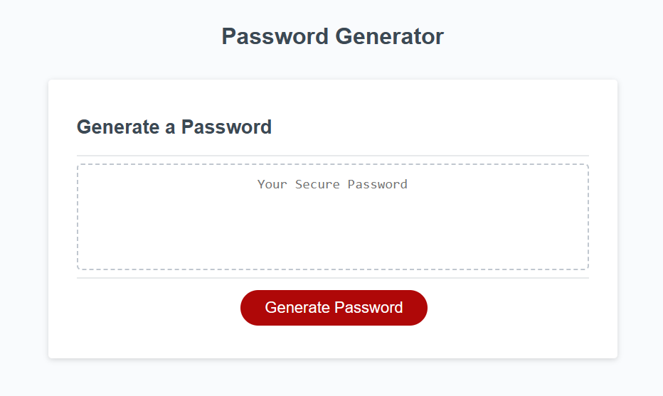
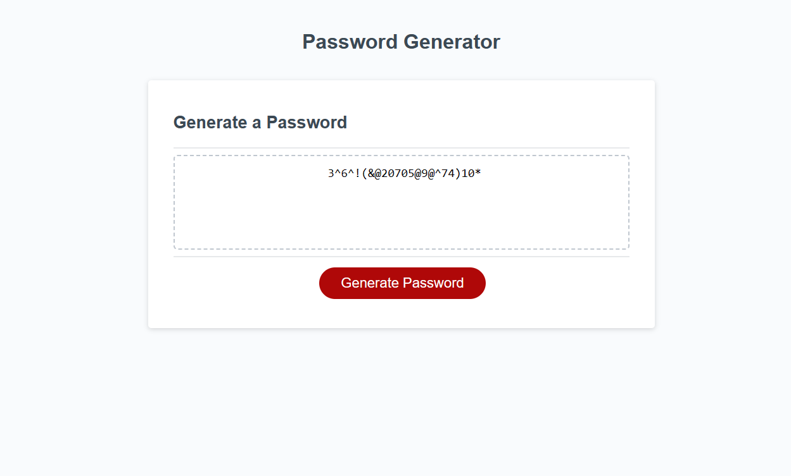

# Password Generator Starter Code
A randomised password generator, created to provide secure passwords to those that need them.

## Description

This site was created specifically for those who want to protect their digital accounts, as it provides a unique, randomised (and customisable) password, which is different each time it is generated. The site consists of a title ('Password Generator'), and a white box which contains a smaller dotted-line box (which is where generated passwords are displayed) and a large red button ('Generate Password'), which, when clicked on, generates a randomised password.

## Installation

N/A

## Usage
To use this application, please navigate to: https://p-h-davies.github.io/Password-Generator/. 

Once you are on the application, press the large, red button which says 'Generate Password'. This will trigger a series of prompts at the top of your window, asking you to define the desired length of your password (between 8-128 characters), and the type of characters you'd like to include (numerical, lowercase, uppercase & special characters). 

Once you have entered all of your preferences, a randomly generated password, created using your preferences, will appear in the dotted-line box.

## Credits

Starter code was provided by Xandromus (Xander Rapstine) - this code was the structure of the HTML, .gitignore and CSS, and also provided the empty (aside from comments) script.js file and README file.

## License

Please refer to the LICENSE in the repo.